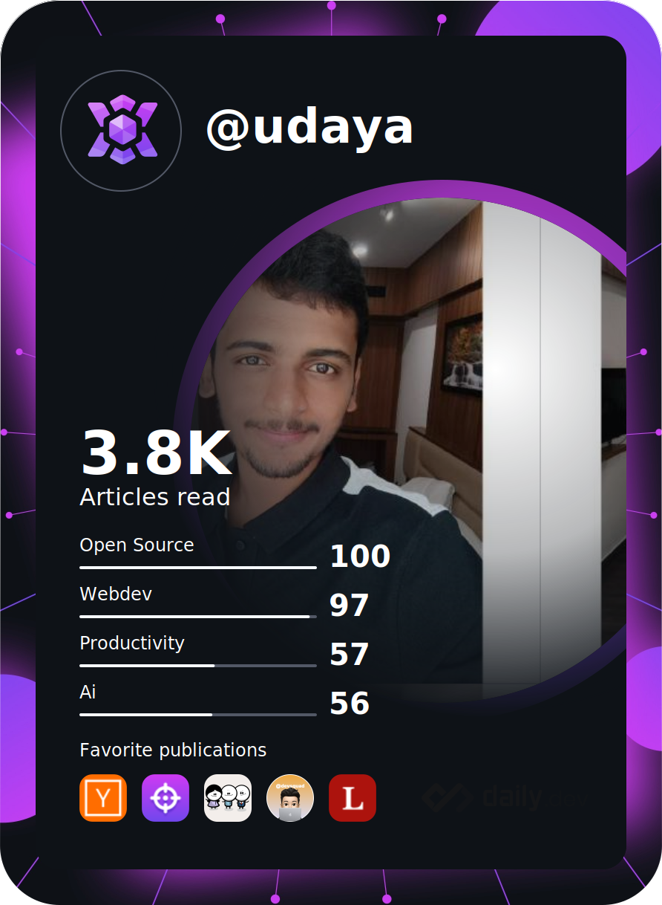
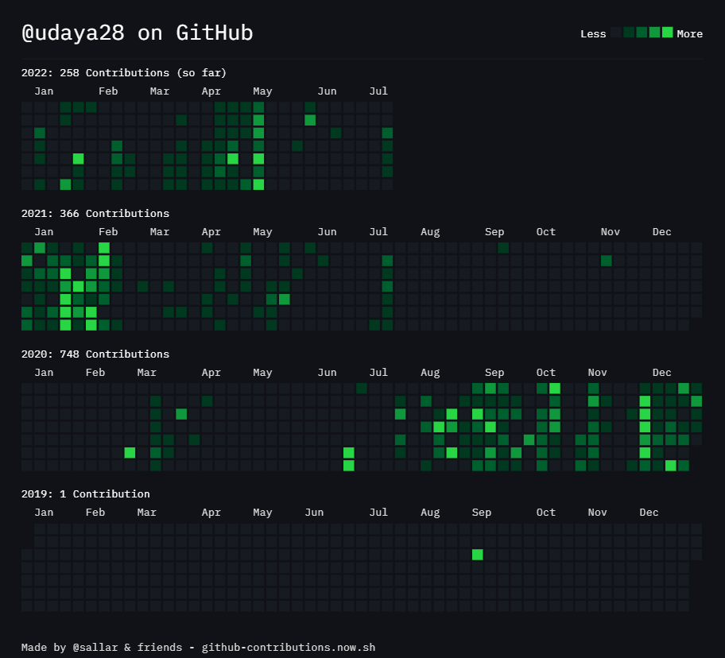

<!-- https://github.com/kyechan99/capsule-render -->

- ✨ I am a Full Stack Web Developer
- 🔭 I’m currently looking for internships on web development (frontend,backend) ...
- 🌱 I’m currently learning next.js, DSA ...
- 💬 Ask me about Java Script,Type Script, React, Node JS, Type Script, serverless lambda and more ...
- 📫 How to reach me: [LinkedIn](https://www.linkedin.com/in/udaya28/), [Twitter](https://twitter.com/udaya28_)
- 🎓 Education: BE-CSE 23-graduate
- ⚡ Experience: 
  - 2+ years of experience in web development
  - I have developed multiple real-world projects and I  have worked on two internships. 
  - My first internship (4 months) was a full stack developer role (React, Material UI, TypeScript, Express, MySQL)
  - My second internship (6 months) was a backend developer role (JavaScript, TypeScrip, Serverless, AWS Lambda, DynamoDB)

<!-- https://github.com/tandpfun/skill-icons -->

 

<!-- https://github.com/DenverCoder1/github-readme-streak-stats -->

<!-- https://github-contributions.vercel.app/ -->
